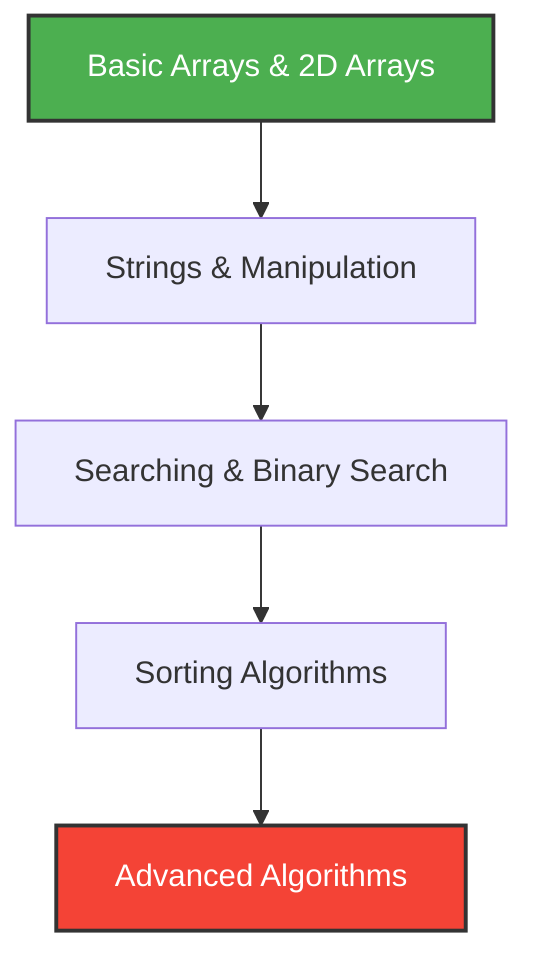

# ⚡ Ultimate C++ Data Structures, Algorithms & LeetCode Arena

<div align="center">

<!-- DYNAMIC TOP BANNER -->


[](https://isocpp.org)
[](https://leetcode.com)
[](https://opensource.org)
[](https://github.com)

<p align="center">
  <b>A highly optimized, meticulously documented, and beautifully formatted sandbox containing production-grade C++ implementations of fundamental Data Structures, Algorithms, and top-tier LeetCode solutions.</b>
</p>

[📌 Explore Roadmaps](#-curated-dsa-roadmaps) • [🎯 LeetCode Hub](#-leetcode-grind-hq) • [🛠️ Setup Guide](#-quick-start--compilation) • [🤝 Contribute](#-open-source-contribution)

</div>

---

## 🔥 What Makes This Repository Different?

* 🏎️ **Maximized Performance**: Every solution uses standard competitive programming fast I/O optimizations.
* 🧠 **Memory Conscious**: Explicit tracking of spatial complexity; clean pointer and memory management (`RAII`).
* 🎨 **Visual Architecture**: Clean, modular structure using advanced modern C++ constructs.

---

## 🎯 LeetCode Grind HQ

### 📊 Live Coding Metrics
<p align="center">
  <!-- Dynamic Real-Time LeetCode Stat Card. Replace 'your-leetcode-username' with your actual username -->
  
</p>

> 💡 *Tip: Paste your exact username into the card query snippet above to watch your live platform stats synchronize directly with GitHub!*

### ⚔️ Curated Challenge Series

📂 LeetCode-Solutions/├── 🟢 Easy/             # Foundational building blocks (Two Sum, Valid Parentheses...)├── 🟡 Medium/           # Core interview patterns (LRU Cache, Container With Most Water...)└── 🔴 Hard/             # Advanced algorithmic puzzles (Merge k Sorted Lists, Edit Distance...)
| Problem ID | Title | Difficulty | Core Patterns Used | Solution Code |
| :---: | :--- | :---: | :--- | :---: |
| #0001 | Two Sum | 🟢 Easy | Hashing, Two Pointers | [Click Here](./BasicArrays/) |
| #0015 | 3Sum | 🟡 Medium | Sorting, Two Pointers | [Click Here](./Sorting/) |
| #0042 | Trapping Rain Water | 🔴 Hard | Monotonic Stack, Two Pointers | [Click Here](./BasicArrays/) |

---

## 🗺️ Curated DSA Roadmaps

### 👁️ Structural Visual Mapping
Below is the structural flow mapping out the execution layers inside this repository:



### 📁 Current Tracking Matrix

* **Linear Data Structures & Arrays**
  * `BasicArrays` 🟩 *Fully Implemented*
  * `2DArray` 🟩 *Fully Implemented*
  * `Strings` 🟩 *Fully Implemented*
* **Search & Sort Mechanics**
  * `Searching` 🟩 *Fully Implemented*
  * `BinarySearch` 🟩 *Fully Implemented*
  * `Sorting` 🟩 *Fully Implemented*

---

## 📈 Complexity & Analytics

### ⏱️ Big-O Growth Curves
When designing algorithms, runtime execution scales alongside data input sizes. Refer to the reference matrix plot below:

<p align="center">
  
</p>

### ⚡ Performance Reference Benchmarking

| Paradigm | Best Time | Average Time | Worst Time | Space Complexity |
| :--- | :---: | :---: | :---: | :---: |
| **Binary Search** | $\mathcal{O}(1)$ | $\mathcal{O}(\log n)$ | $\mathcal{O}(\log n)$ | $\mathcal{O}(1)$ |
| **Quick Sort** | $\mathcal{O}(n \log n)$ | $\mathcal{O}(n \log n)$ | $\mathcal{O}(n^2)$ | $\mathcal{O}(\log n)$ |
| **Merge Sort** | $\mathcal{O}(n \log n)$ | $\mathcal{O}(n \log n)$ | $\mathcal{O}(n \log n)$ | $\mathcal{O}(n)$ |

---

## 🛠️ Quick Start & Compilation

### 🧰 Environment Prerequisites
* A compiler natively supporting **C++17** or **C++20** standard frameworks (`GCC 9+`, `Clang 10+`, or `MSVC 2019+`).

### ⚙️ Command Line Compilation
Clone the repository and compile test targets using optimized compilation flags:

```bash
# Clone down this arena
git clone https://github.com
cd dsa-cpp-practice

# Compile with O3 optimization flags for high execution speeds
g++ -O3 -std=c++20 BinarySearch/your_file.cpp -o solution.out

# Launch the execution binary
./solution.out
```

---

## 🤝 Open Source Contribution

Got a more optimal spatial/temporal runtime solution? Pull Requests are highly encouraged!

1. Fork the codebase 🍴
2. Initialize your feature branch (`git checkout -b feature/OptimalSolution`)
3. Commit your implementations (`git commit -m 'Feat: Add optimized approach'`)
4. Push clean code to the origin branch (`git push origin feature/OptimalSolution`)
5. Open an official **Pull Request** 🚀

---

## 📜 License & Acknowledgments

Distributed strictly under the **MIT License**. Check out `LICENSE` file within the repo root context for extensive details.

<div align="center">
  <h3>Give this repository a ⭐ star if it helps clear your coding interviews!</h3>
</div>

